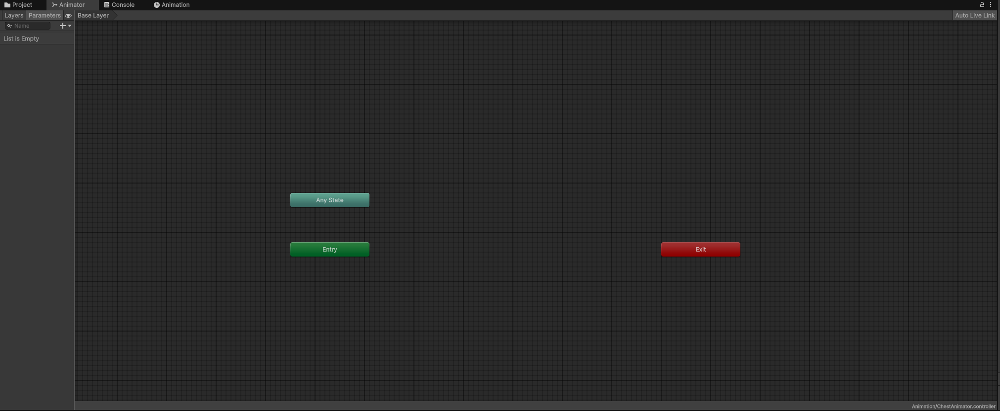

# Class 3

In this third class, you'll learn the following:
- Creating a basic animator controller
- Making a User Interface (UI)
- Using a scriptable object to store data
- Switching scenes
- Building the project

## Animating the chest

Like last time, you can get the current project from the repository of the previous class. 
We left off at the chest interaction. However, we are only printing out a simple message in the console window.
We want to see our chest open when we interact with it. For that, we will need to animate it.
The chest already comes with an opening animation, you can preview it by clicking the arrow on the chest asset 
and selecting the *Armature|Chest_open* Animation Clip. A little preview should appear at the bottom of your inspector.


### The Animator Controller

Go to your chest prefab and add an `Animator` component to the root object. 
Only one of the settings will be important here, and that is the Runtime Animator Controller.
So let's start by creating a new RuntimeAnimatorController asset (Create->Animation->Animator Controller).
I'll name it *ChestAnimator*. You can already drop it in the animator slot of the chest component.

Then, double click on the asset to enter the Animator window. It should look like this:



An animator in Unity is also called a state machine. 
It means that you can define a specific behaviour for different states, and add transitions between those states.
We'll need two states:
- closed
- open

To make a new state, right-click, Create State->Empty. Create the two states. 
One of them should be orange and linked to the `entry` state, while the other is gray and alone.
The orange one should be `closed`, as we want our chest to start closed and then open it.
If you did it the other way around, either rename them or right-click on the grey one, Set as Layer Default State.
Then, in the inspector, assign the correct animations to each state (click on the dot at the end of the `Motion` field).

If you try your scene, nothing should have changed, but if you set the `open` state as the default state, the chest should open itself when starting the scene.

### Adding transitions

to switch from one state to another, we need to create transitions. Right-click on the `closed` state, Make Transition. 
Then click on the other state to link it. Select the transition to open its inspector. 
A little preview is available at the bottom. Everything looks fine, but if we try it right now, the chest will immediately switch to the open state
(actually, the two states will be mixed during 0.25s before the transition ends).

Take a look at the settings. 


- The first one, `Has Exit Time` (and its respective value under the settings dropdown), 
is used to tell how long you want the original state to be active for before the transition occurs. 
This can be helpful when linking chained animations, but we don't want it here. Just untick the box (and the value field should get grayed out, along with a warning).
- Then, we have the `Fixed Duration` one. It defines if the transition duration is in seconds or percents, and you can set the value right under.
- Skipping the Interruption settings, we have the `Conditions` list. They define when the transition can be triggered. 

Since we did not use any Exit Time, the animator does not know when to trigger the transition. To add a condition, we first need some values to check.
On the left of the Animator window, under the `Parameters` tab, add a new `Bool` (a `Trigger` could also work very well) named *isOpen*.
then in the Conditions list, add a new one for when `isOpen` is true.


Press Play, select your chest to get the animator realtime preview, then in the animator window click on the `isOpen` tickbox to set it to true. 
The animation should trigger. All that's left for us is to set it to true when we interact with the chest.

### Linking with the chest script

In your chest script, add a reference to the animator and call the `SetBool()` method when interacting.

```cs
public class Chest : MonoBehaviour, IInteractable
{
	public Animator animator;

	public void Interact()
	{
		animator.SetBool("isOpen", true);
	}

}
```

Try your scene (don't forget to link the animator reference in your prefab), *et voilà*!

## Adding a UI pop up

Let's improve our chest even more. Now that we can see it opening, we can add a pop up telling the player what they found inside. 
We'll split the work in two parts:
- Creating the template UI
- Creating custom items to obtain

### The UI Canvas

First thing first, create a UI->Canvas. It created two objects, the canvas and another one called EventSystem. 
The latter is used by unity to convert user inputs to events the ui can understand (like when you click on a button).
If you focus the scene view on the canvas, the scene should zoom out quite much until you see a big white frame. 
Change the scene orientation to	the back view in ortographic mode (oposite of perspective) by using the tool on the top right corner (right-clicking can help):


That way, you'll be able to work on your UI more easily.

Looking at the Canvas inspector, you can already see that the default `Transform` was switched for a `RectTransform`.
This is a variant of the Transform that is used by all UI elements.

Next, in the Canvas component, we'll get rid of the warning by ticking the *Vertex Color* checkbox 
(the default setting was changed in Unity 6, and it might change again in the next versions).

Then, we will change the `UI Scale Mode` of the `Canvas Scaler` component from *Constant Pixel Size* to *Scale With Screen Size*.
This will help automatically adjusting the UI with different screen resolutions. 
You can choose a `Reference Resolution` (I usually use 1920x1080), this will be the resolution you'll be working with in the editor and that will be scaled on other resolutions.

### Creating the pop up

To create our pop up, we'll start by adding a `Panel` object as a child of the canvas and renaming it *PopUp*. 
On the top left corner of the RectTransorm, you'll find a tool to set the anchors, pivot and position of the UI object. 
Correctly setting these values based on where on the screen (relative to the parent object) you want to place your UI
element will help the canvas scaler adjusting your UI correctly instead of it going out of screen or pultiple elements everlapping each other.

We will set the panel to be middle/center for all 3 settings (by holding alt+shift while clicking): 


You can then resize it as you see fit either through the inspector or by going to the rect tool in the scene view (T key or square symbol next to the scale tool).
Holdin alt while dragging the rect allows resizing around the center of the object, otherwise you'll be moving it.
Be careful when using the scale tool as changing the scale of an object also affects its children. 
Its often better to keep the scale of UI elements to 1, and instead changing the width and height values.

Next, we'll populate our popup with an image, some text and a button.
Add an image, and add the [chest_icon.png](ClassTutorialAssets/class3/chest_icon.png) asset to your project or any other image to act as a placeholder.
In its import settings, change the `Texture Type` to `Sprite` and the `Sprite Mode` to `Single`. Apply the changes, and link the sprite to you image ui element.

Once you're done, add a `Text - Text Mesh Pro` element. You should see a window appear asking you to `Import TMP Essentials`. 
Click the button and close the window. Text mesh pro is a very powerful tool that will allow you to customize all text UI quite easily.
Position your text object at the top of the popup (don't forget the anchors).

In the text component options, you can set the content, alignment, base color and style of your text. 
you can also use html-like tags in the text setting (e.g. `<color=orange>some orange text</color>`).

Lastly, let's add a (text mesh pro) button to the bottom of our pop up. It comes with a child text object where you can change the text of the button.

My popup looks like this:


### Linking it to the chest

We've created the pop up, now we need it to appear when interacting with the chest. We'll first be making a UI script called `PopUpController`.

We'll need a reference to the popup root object to activate and deactivate it whenever we want. We also want a method for showing the popup, and one for hiding it.
```cs
public class PopUpController : MonoBehaviour
{
    public GameObject popUpObject;

	public void ShowPopUp()
    {
        popUpObject.SetActive(true);
    }

    public void HidePopUp()
    {
        popUpObject.SetActive(false);
	}
}
```

Then, we want our chest script to call the `ShowPopUp` method when we interact. 
One way to do so would be to simply add a public reference to the popupcontroller in the chest script, and assign it on the chest object. 
However, our UI is not inside the chest prefab (as we do not want it to be duplicated for every chest in the scene) 
so we would have to manually set the reference for every chest in the scene. 

Instead, we will search for the popup object in the start method of the chest script by using `FindAnyObjectByType<PopUpController>()`.
You have to be careful when using `Find` methods as they will search through the objects present in your scene, 
and calling them each frame would be pretty inefficient. You should prefer calling them once and storing the result in a variable for later reuse.

Our chest script should now look like this:
```cs
using UnityEngine;

public class Chest : MonoBehaviour, IInteractable
{
	public Animator animator;
	private PopUpController popUpController;

	private void Start()
	{
		popUpController = FindAnyObjectByType<PopUpController>(FindObjectsInactive.Include);
	}

	public void Interact()
	{
		popUpController?.ShowPopUp();
		animator.SetBool("isOpen", true);
	}
}
```

The `?` before the call to the function in `popUpController?.ShowPopUp();` makes sure that the popUpController variable is not null before trying to access its members.
It is equivalent to checking `if (popUpController != null)` before calling the method.
This prevents errors in case the game did not find any PopUpController object, but we won't be receiving any message to tell us so. 
We would have to add our own error checking system to make sure The chest is correctly initialized otherwise the pop up wouldn't show up and we wouldn't know why.

We also tell the engine to search for inactive objects as we won't have our pop up active when the game starts.

For now, let's add the popup script to the popup object and fill the PopUpObject field. Let's also hide the pop up by default 
(by unticking the checkbox near the object's name in the inspector), and try our scene.

And everything works! Or so it seems... The pop up does show up when interacting with the chest, but we can still move around, 
and we can't click on the button or make it go away in any way.

So first, let's try to stop the player as if we were pausing the game.
We'll be adding a new script that will manage the player states.
Let's call it `PlayerController`.

the only thing we actually need to prevent the player from moving is to block its inputs. 
The PlayerInput component that we use comes with a handy method called `DeactivateInput`, so we'll be using that one.
We also want the cursor to become visible again when we deactivate the player so that we can navigate the menus.

```cs
using UnityEngine;
using UnityEngine.InputSystem;

public class PlayerController : MonoBehaviour
{
	public PlayerInput playerInput;

	public void DeactivatePlayer()
	{
		playerInput?.DeactivateInput();
		Cursor.visible = true;
		Cursor.lockState = CursorLockMode.None;
	}

	public void ActivatePlayer()
	{
		playerInput?.ActivateInput();
		Cursor.visible = false;
		Cursor.lockState = CursorLockMode.Locked;
	}

}
```

That's nice, but now we are faced with a similar problem as the one we had with the popupcontroller: we need to be able to access these methods from other scripts, 
without having to reference the player each time. We could use the same system, but what if the player is instanciated later in the game? 
Instead, we'll be using a concept called a Singleton. 

To put it simply, a singleton is a static reference to an instance of an object, meaning anyone can access the object simply from the class name. 
However, the object needs to be unique, which works quite well in our case.

To create our singleton, add these lines to your script:
```cs
public static PlayerController Instance;

private void Awake()
{
	if (Instance == null)
	{
		Instance = this;
	}
	else
	{
		Destroy(gameObject);
	}
}
```

And to access it, go to your PopUpController and change the Show and Hide methods like this:
```cs
public void ShowPopUp()
{
    popUpObject.SetActive(true);
    PlayerController.Instance?.DeactivatePlayer();
}

public void HidePopUp()
{
    popUpObject.SetActive(false);
    PlayerController.Instance?.ActivatePlayer();
}
```

If you try it now and nothing has changed, it might be because you forgot to add the script to the player prefab and link the player input reference.
If you had set everything correctly, yu can't move anymore but nothing happens when you click the button, so you are essentially locked in that state.

We have to tell the button to call the HidePopUp method when it registers a click event. For that, go to the button inspector and in the `OnClick` 
setting, add a listener and link the pop up object, then select the Hide method.


And now we should almost be good.
If you were thorough enough with your testing, you should have found out that you can interact with the chest even when it is already open.
To prevent that, we'll just add a `opened` boolean to our chest and only process the interaction if it is false:
```cs
private bool opened = false;

public void Interact()
{
	if (opened) return;
	opened = true;
		
	...
}
``` 


### Creating custom items

Finding a chest inside a chest is fun, but we want to find more objects. But we also don't want to create a new ui for each object.

We will be creating special assets called `ScriptableObjects`, that will hold our items data and that we'll use to setup the ui each time we open a chest.

Unity 6 comes with a template script for ScriptableObjects, that you can use with Create->Scripting->ScriptableObject Script. 
Let's make one inside an *Item* folder and call it *ItemData*.
The default code creates a MenuItem that will help us create new ItemData asset files.

But before we create any asset, let's add some content to them. 
What we want is an item name, and an item icon. Let's add both.

```cs
using UnityEngine;

[CreateAssetMenu(fileName = "ItemData", menuName = "Scriptable Objects/ItemData")]
public class ItemData : ScriptableObject
{
    public string itemName;
    public Sprite icon;
}
```

Now, we can go back to Unity and create a new ItemData asset (Create->Scriptable Objects->ItemData). 
I'll go with a ChestItem, since I already have an icon for that. 
I'll also change the text color to blue to make sure I see the difference with the default one when testing.


We now need to do two things:
- store the data in the chest script,
- setup the pop up with the iven item data.

We'll start with the second one:

In our PopUpController, we need a reference to the text object and the image object.
Then, we need a method that takes an ItemData in argument and changes the text and image accodingly:

```cs
public Image popUpIcon;
public TMP_Text itemName;

public void SetupPopup(ItemData item)
{
    popUpIcon.sprite = item.icon;
    itemName.text = "You found a " + item.itemName + "!";
}
```

You will also need to add the correct `using` directives to be able to use the `Image` and `TMP_Text` classes:
```cs
using TMPro;
using UnityEngine.UI;
```

Don't forget to set the references on the pop up object.

For the chest, just add an ItemData variable and call the popup setup method `popUpController?.SetupPopup(item);` when interacting.

And that's it for our chest !

## Creating a main menu scene

Now that you've come this far, you should be able to quickly create a new scene, and make a simple menu with the game title and a *Start* button.

If you want to achieve stunning text with TMP, check out the [documentation](https://docs.unity3d.com/Packages/com.unity.textmeshpro@4.0/manual/index.html) for more info on how to use it.
An easy way to change the look of your text is by creating a copy of the default material and adjusting it to your needs:


If you don't get the same results in the scene view and in the game view, that's because you need to switch your canvas mode to `Screen Space - Camera` 
and activate `postprocessing` in your camera settings.

Now, we want our game to load the Forest scene when we click on the Start button.
We'll create a simple `MainMenuManager` script, that will handle the logic for the main menu.

```cs
using UnityEngine;
using UnityEngine.SceneManagement;

public class MainMenuManager : MonoBehaviour
{
	public string startScene = "Forest";
	public void StartGame()
	{
		SceneManager.LoadScene(startScene);
	}
}
```

And like we did for the pop up, we just need to link the `StartGame()` method to the start button OnClick event.

However, if we try our scene now, we get the following error message:
> Scene 'Forest' couldn't be loaded because it has not been added to the active build profile or shared scene list or the AssetBundle has not been loaded.  
> To add a scene to the active build profile or shared scene list use the menu File->Build Profiles
>
> UnityEngine.SceneManagement.SceneManager:LoadScene (string)  
> MainMenuManager:StartGame () (at Assets/Scripts/UI/MainMenuManager.cs:9)  
> UnityEngine.EventSystems.EventSystem:Update ()

Jut follow the instructions and add your scene (just drag and drop the scenes in the list). 
You can rearrange them so that the main menu is always the first scene loaded when you start the game.


Try again, and you should land in the forest after clicking the start button.

## Building the game

Since the start of the course, we've only played in the unity editor. 
However, if you want peopleto play your game, you'll have to give them an executable.

To do that, you just have to press the build button in the build profiles window (with the target platform you want)
and select the folder where your files will be stored. You can also access the Player Settings from this window
or through Edit->Project Settings->Player where you'll be able to change the app name and icon among many other things.


If you are building for the first time, it might take quite long depending on your pc (up to a few minutes), but the process shoul speed up the next time.
Since we haven't made any menu to quit the game, just press **Alt+F4** to close it.

## Conclusion

And that's it for this one! Feel free to add menus, items or anything else to train. 

You could also make it so that a chest stores a list of items, and when you open it, it chooses randomly one of them.
```cs
// To use a list
public List<ItemData> myList;
// or an array
public ItemData[] myArray;

// Access the members like this:

myList[0]
myArray[0]
// returns the first element

myList[myList.Count-1]
myArray[myArray.Length-1]
// returns the last element
```

See you in the next class!

---
*course by Julien Charvet for GCC*

[previous class](https://github.com/Skydrag42/GCC_Unity_Forma_Class2/)
||
[next class](https://github.com/Skydrag42/GCC_Unity_Forma_Class4/)
